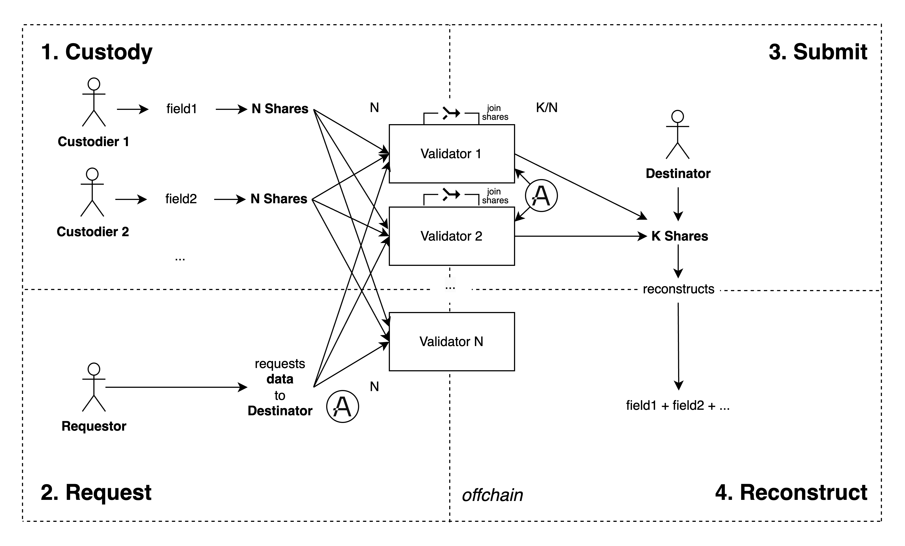

<h1 align="center">
    <picture>
        <source media="(prefers-color-scheme: dark)" srcset="./media/aleo-dcp-dark-logo.png" width="200">
        <source media="(prefers-color-scheme: light)" srcset="./media/aleo-dcp-logo.png" width="200">
        
    </picture> 
    <b>
        Aleo - Data Custody Protocol
    </b>
</h1>

Aleo DCP is a decentralised MPC protocol built on Aleo to **allow any program to custody arbitrary private data** that can be transactionally withdrawn.

Data is splitted following **Shamir Secret Sharing (SSS)** algorithm. Shares are custidied by Validators, that can be dynamically updated through a voting gouvernance mechanism. They are incentivized with **Aleo credits fees** paid by requester of custodied data.

## Use Cases

**Aleo DCP** enables use cases such as:

- **Private Election** - A voting system that does not disclose results before a specific time to avoid votes being influenced by previous votes.
- **pNFT Marketplace** - Marketplace for NFTs with private data and owners, with one click buy mechanism as with regular NFTs. Seller doesn't have to come back to transfer NFT data once listing has been accepted by a buyer.
- **Decentralised data broker** - Marketplace for selling SQL query results. Sell access to large amount of offchain data resulting from a zkSQL query over a RDBMS, with proof of conformity of the result (see [snarkDB](https://snarkdb.com)).

## How it works?

### General idea

The protocol allows any program to privately hold a `field` element and distribute it transactionally. It can be used to store:

- A View Key protecting record(s), enabling arbitrary data storage.
- A `field` directly, allowing addition updates on stored data by leveraging additive homomorphic properties of SSS.

### Custodying arbitrary record data

Protocol enables programs to hold and distribute data stored in any arbitrary record:

1. Record from any program containing the private data is transferred to an address, which View Key (generated randomly) is splitted in shares among N validators using Shamir Secret Sharing algorithm. This is the **Custody** step.
2. This view key can later be requested to be sent privately to any destination address, by initial program. This is the **Request** step.
3. A decentralized network of [validators](#validators) can then process the query immediatly. It consists of peers running bot JS script, that provide their respective share to the destination address. This is the **Submit** step.
4. The requestor can then reconstruct the View Key offchain using k of n shares and decipher the private data from the original record. This is the **Reconstruct** step.

**Request**, **Execute**, and **Submit** step can all happen without awaiting validation from the original caller of **Custody** step transaction.

### Additive homomorphic operations support

**Custody** step can be call multiple times, with the same `custody_key`, by a program that imports DCP. In that case, shares associated with custodied `field` elements must simply be added by validators before being submitted to destinator.

## Protocol Governance

### Validators

Protocol has **a set of Validators** and a **vote threshold**, initiated by deployer, which can be updated through a voting mechanism.

Validors role is to custody data shares and process queries.

It supports any maximum amount of validators decided on deployment of protocol programs.

Validators propose and vote for **Proposals**, consisting of a new set of Validators and next vote threshold.

[Check implementation of gouvernance in **`dcp_core_protocol.leo`**.](programs/dcp_core_protocol/src/main.leo)

### Run a Validator

**`validators/run-validator`**: Javascript implementation of validator program.
*Under developement...*

### Governance DApp UI

Incoming React frontend application built with `aleo-wallet-adapter` package. It is made for validators to manage Governance of the protocol.

**`validators/ui`**: TODO.

#### Features

- Initiate a new **Proposal**.
- Vote for any exisiting **Proposal**.

## Usage

### Call Aleo DCP from any program

#### For arbitrary record data

For a program to custody private data, it must import **`data_custody_protocol.aleo`**.

1. To custody data, it can:
    - Call `data_custody_protocol.aleo/custody_data_as_program((data_view_key as field), threshold, ...)`
    - Send any records to `(data_view_key * 522678458525321116977504528531602186870683848189190546523208313015552693483group) as address`
2. It can then call `data_custody_protocol.aleo/request_data_as_program` to initiate a data request.
3. Validator bots automatically call `dcp_core_protocol.aleo/process_request_as_validator` to accept the data request.
4. `data_custody_protocol.aleo/assert_completed_as_program` can then be used by the program to check if data was effectively transmitted.

#### Multiple Custody steps

In case **Custody** step was called more than once for a single `request_id`:

- Between step 3 and step 4, validator bots must call `dcp_core_protocol.aleo/join_shares_as_validator` as many time as there are additional **Custody** step.

### Example

An obvious use case for the protocol is a Marketplace Program for exchanging NFTs with secret data. A standard proposal for such NFTs is detailed at [**`arc721_example.leo`**](/examples/nft_marketplace/programs/arc721_example/src/main.leo).

[Check implementation of the marketplace in **`marketplace_example.leo`**](/examples/nft_marketplace/programs/marketplace_example/src/main.leo)

*This is a very simplified marketplace to focus on the **`data_custody_protocol.aleo`** program usage. This is why seller/buyer privacy as well as offers are not implemented here.*

## Developement

### Setup developement environement

- Build [Leo](https://github.com/ProvableHQ/leo), [snarkVM](https://github.com/AleoNet/snarkVM), [snarkOS](https://github.com/AleoNet/snarkOS) from source.
- Run a local devnet, by following [#6.3 of snarkOS official repository](https://github.com/AleoNet/snarkOS?tab=readme-ov-file#633-view-a-local-devnet).
- *(Optional)* Run [Haruka's open source Explorer](https://github.com/HarukaMa/aleo-explorer).
- Duplicate `./developement/.env.example`, update it with relevant environment variables, rename it `.env`.

### Build

- Run **`./developement/build.sh`**.

### Deploy

- Run **`./developement/deploy.sh`**.

### Test

- Run **`./developement/test.sh`**.

## Future Improvements

- **Improvement 1** - Update **Destinator** to an array of addresses ?
