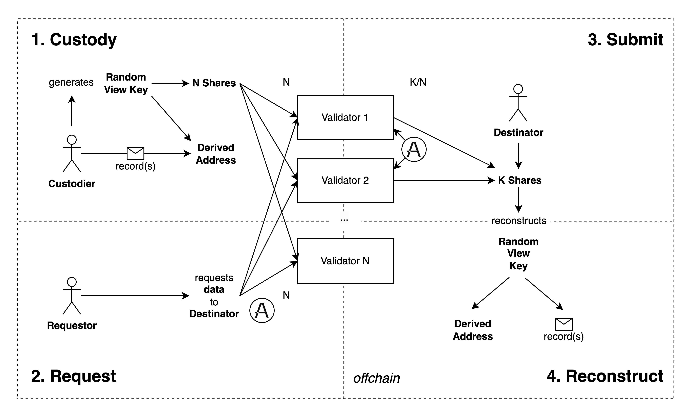

# Aleo DCP: Data Custody Protocol

A decentralised MPC protocol built on Aleo to **allow any program to custody arbitrary private data** that can be transactionally withdrawn.

Data is splitted into Shamir shares which are custidied by Validators, that can be dynamically updated through a voting gouvernance mechanism. They are incentivized with **Aleo credits fees** paid by requester of custodied data.

## Use Cases

**Aleo DCP** enables use cases such as decentralised data broker or private data NFT marketplace with one click buy.

## How it works?

### For custodying arbitrary record data

Protocol enables to hold data stored in any arbitrary record

1. Record from any program containing the private data is transferred to an address, which View Key (generated randomly) is splitted in shares among N validators using Shamir Secret Sharing algorithm. This is the **Custody** step.
2. This view key can later be requested to be sent privately to any destination address, by initial program. This is the **Request** step.
3. A decentralized network of [validators](#validators) can then process the query immediatly. It consists of peers running bot JS script, that provide their respective share to the destination address. This is the **Submit** step.
4. The requestor can then reconstruct the View Key offchain using k of n shares and decipher the private data from the original record. This is the **Reconstruct** step.

**Request**, **Execute**, and **Submit** step can all happen without awaiting validation from the original caller of **Custody** step transaction.



### For custodying data with homomorphic operation support

Leverage Shamir Secret Sharing additive homorphic property in protocol... TODO

## Protocol Governance

### Validators

Protocol has **a set of Validators** and a **vote threshold**, initiated by deployer, which can be updated through a voting mechanism.

Validors role is to custody data shares and process queries.

It supports any maximum amount of validators decided on deployment of protocol programs.

Validators propose and vote for **Proposals**, consisting of a new set of Validators and next vote threshold.

[Check implementation of gouvernance in **`protocol_core.leo`**.](programs/protocol_core/src/main.leo)

### Run a Validator

Incoming Javascript implementation.

**`validator/run.js`**: TODO.

### Governance DApp UI

Incoming React frontend application built with `aleo-wallet-adapter` package. It is made for validators to manage Governance of the protocol.

**`validator/ui`**: TODO.

#### Features

- Initiate a new **Proposal**.
- Vote for any exisiting **Proposal**.

## Usage

### How to call it from any other program?

For a program to custody private data, it must import **`data_custody_protocol.aleo`**.

1. To custody data, it must:
    - Call `data_custody_protocol.aleo/custody_data_as_program(data_view_key, threshold, ...)`
    - Send any records to `(data_view_key * group::GEN) as address`
2. It can then call `data_custody_protocol.aleo/request_data_as_program` to initiate a data request.
3. Validator bots automatically call `protocol_transfers.aleo/process_request_as_validator` to accept the data request.
4. `data_custody_protocol.aleo/assert_completed_as_program` can then be used by the program to check if data was effectively transmitted.

### Example

An obvious use case for the protocol is a Marketplace Program for exchanging NFTs with secret data. A standard proposal for such NFTs is detailed at [**`arc721_example.leo`**](/examples/nft_marketplace/programs/arc721_example/src/main.leo).

[Check implementation of marketplace in **`marketplace_example.leo`**](/examples/nft_marketplace/programs/marketplace_example/src/main.leo)

Here are interactions with the protocol snippets:

```rust
import data_custody_protocol.aleo;
import arc721_example.aleo;
import credits.aleo;

program marketplace_example.aleo {
    const mpc_threshold: u8 = 8u8;

    ...

    async transition list(
        ...
        private secret_random_viewkey: scalar,
        private privacy_random_coefficients: [field; 15],
        private validators: [address; 16],
    ) -> (NFTView, Future) {
        ...

        let secret: field = secret_random_viewkey as field;
        let nft_data_address: address = (data_view_key * group::GEN) as address;

        let custody_id: field = BHP256::hash_to_field(nft_data_address);

        let data_custody: Custody = Custody {
            initiator: self.caller,
            custody_id: custody_id,
            threshold: mpc_threshold,
        };

        let data_custody_hash: field = BHP256::hash_to_field(data_custody);

        let custody_data_as_program_future: Future =
            data_custody_protocol.aleo/custody_data_as_program(
                secret, // private secret : field,
                custody_id, // private custody_id: field,
                privacy_random_coefficients, // private coefficients: [field; 15],
                validators, // private validators: [address; 16],
                mpc_threshold // private threshold: u8 <= 16
            );

        let list_future: Future = finalize_list(
            ...
            custody_data_as_program_future
        );
        ...
    }
    async function finalize_list(
        ...
        custody_data_as_program_future: Future
    ) {
        custody_data_as_program_future.await();
        ...
    }

    /*
        Validators associated with the listing can be retrieved offchain using: 
            protocol_core.aleo/validator_sets.get(
                protocol_core.aleo/custodies.get(
                    listing_data.data_custody_hash
                )
            )
    */
    async transition accept_listing(
        ...
        public validators: [address; 16],
        public validator_fee: u64,
        private protocol_fee_record: credits.aleo/credits
    ) -> (credits.aleo/credits, Future) {
        ...
        let custody_id: field = BHP256::hash_to_field(listing_data.nft_data_address);
        let (
            change,
            request_data_as_program_future
        ): (
            credits.aleo/credits,
            Future
        ) =
            data_custody_protocol.aleo/request_data_as_program(
                custody_id, // private custody_id: field,
                self.signer, // private to: address,
                mpc_threshold, // private threshold: u8,
                validators,// public validators: [address; 15],
                validator_fee,
                protocol_fee_record,
            );
        let accept_listing_future: Future = finalize_accept_listing(
            ...
            request_data_as_program_future,
        );
        ...
    }
    async function finalize_accept_listing(
        ...
        request_data_as_program_future: Future
    ) {
        ...
        request_data_as_program_future.await();
    }


    // {nft_data, nft_edition} are retrieved by executing 'reconstruct_secret.aleo' offchain on shares sent to buyer by validators
    async transition withdraw_nft(
        nft_data: data,
        nft_edition: scalar,
        ...
    ) -> (arc721_example.aleo/NFT, Future) {
        ...
        let (
            purshased_nft,
            transfer_nft_to_buyer_future
        ): (arc721_example.aleo/NFT, Future) = arc721_example.aleo/transfer_public_to_private(
            nft_data,
            nft_edition,
            self.caller,
        );
        let accept_listing_future: Future = finalize_withdraw_nft(
            ...
            transfer_nft_to_buyer_future,
        );
        return (
            purshased_nft,
            accept_listing_future
        );
    }
    async function finalize_withdraw_nft(
        ...
        transfer_nft_to_buyer_future: Future,
    ) {
        ...
        transfer_nft_to_buyer_future.await();
    }
}
```

*This is a very simplified marketplace to focus on the **`data_custody_protocol.aleo`** program usage. This is why seller/buyer privacy as well as offers are not implemented here.*

## Future Improvements

- **Idea 1:** Allow any amount of data requests. The amount is set as an input of **Custody** step, and is reduced by one on **Request** step.
- **Idea 2:** Allow an array **Destinator** for the data (reduce by array length on **Request** step).
- **Idea 3:** Leverage Shamir Secret Sharing additive homorphic property in protocol
